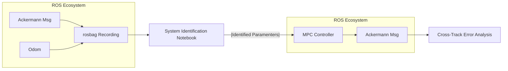

# Polarquest - ROS-Based System Identification & Model Validation for Autonomous Vehicle

> A compact ROS stack to **use data drive system identification for the [Polaris GEM vehicle](https://gitlab.engr.illinois.edu/gemillins/POLARIS_GEM_e2)**, publish paths from CSV files, and run a **Model Predictive Controller (MPC)** built from the **identified vehicle dynamics**.  
Everything runs inside a **Docker** environment with optional NVIDIA GPU acceleration.


---

## Overview

This project provides a self-contained setup to:
- Identify the Polaris GEM vehicle dynamics from recorded data.  
- Build and validate an MPC controller based on the identified model.  
- Run and visualize the full system in Gazebo + RViz.  
- Publish custom reference paths for tracking experiments.

All mathematical analysis, system identification steps, and controller derivations are detailed in  
[`analysis/system_identification.ipynb`](https://github.com/ielson/polarquest/blob/main/ws/src/polaris_system_id/src/analysis/system_identification.ipynb).  
A rendered PDF version is also provided for convenience:  
[`analysis/system_identification.pdf`](https://github.com/ielson/polarquest/blob/main/ws/src/polaris_system_id/src/analysis/system_identification.pdf).

---

## Why This Project Matters?

This project implements a full ROS-based system identification and validation pipeline for a Polaris GEM vehicle.
The goal is to:
- Collect vehicle data using ROS
- Identify a physics-consistent dynamic model
- Validate the model against real-world recordings
- Quantify performance using cross-track error (CTE)
- Prepare the model for MPC-based trajectory tracking

## System Architecture



---

## Validation Results

### Model vs Real Pose Tracking (x, y, ψ)


The identified model closely follows the recorded vehicle dynamics.

### Cross-Track Error (CTE)


Final RMSE: **0.337 m**

<details> <summary><b>Installation (Docker +  NVIDIA container toolkit)</b></summary>

Follow the official guides:

Docker: https://docs.docker.com/engine/install/ubuntu/

Nvidia Container Toolkit: https://docs.nvidia.com/datacenter/cloud-native/container-toolkit/latest/install-guide.html
</details>  

After installation:
```bash
# Bring up the preconfigured ROS Noetic container
cd <project-root>/docker
docker compose up -d noetic

# Open a shell inside the workspace
docker exec -it -w /home/dev/code/polarquest/ws noetic-dev bash
```

## Quick Start

### Launch everything
You can start the full simulation and MPC controller with:
```bash
roslaunch polaris_system_id gem_mpc_follower.launch
```
Or use the helper script, which launches everything and displays the tracking error plots when stopped:
```bash
./src/polaris_system_id/launch/launch_and_show_rmse.sh
```

## Manual workflow
```bash
# 1) Gazebo + RViz
roslaunch gem_gazebo gem_gazebo_rviz.launch

# 2) Odometry → TF bridge
rosrun polaris_system_id odom_to_tf.py

# 3) Path from CSV
rosrun polaris_system_id publish_from_csv.py

# 4) MPC controller
#    steer_only: steering control with constant speed (_v_fixed)
rosrun polaris_system_id mpc.py _mode:=steer_only _v_fixed:=6.0 _Ts:=0.05 _Np:=20 _solve_every:=3
# or
#    speed_steer: steering + speed control
rosrun polaris_system_id mpc.py _mode:=speed_steer _Ts:=0.05 _Np:=20 _solve_every:=3 _spd_min:=0.5 _spd_max:=8.0 _spd_slew:=0.6

```

